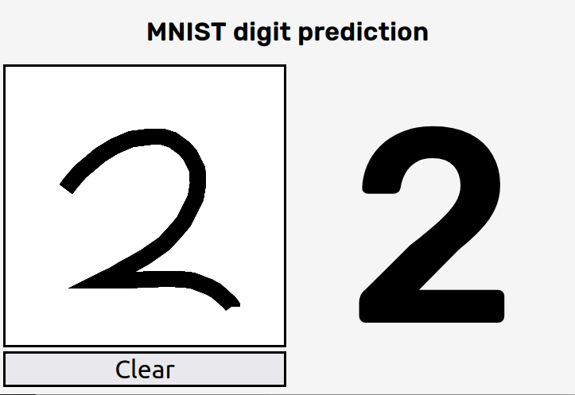

# MNIST classification using SVM models

This is the solution of Exercise 9 of Chapter 5 of the book
*Hands-On Machine Learning with Scikit-Learn, Keras & Tensorflow*.

It classifies digits between 0 and 9. It is trained using the 
[MNIST dataset from OpenML](https://www.openml.org/d/554).

It also provides a simple web interface for testing the predictions,
which can be run with the following command (make sure to install the
dependencies before):

    $ flask run --host=0.0.0.0

and looks like this.

## Install dependencies

Create a virtual environment, activate it and install the
dependencies with

    $ python3 -m venv venv
    $ source ./venv/bin/activate
    $ pip install -r requirements.txt

## Using

You can use the following models from the CLI:

    $ python -m fetch -h
    usage: fetch.py [-h] [-o OUTPATH] [-s] [-r]
    
    Fetch the mnist_784 dataset from openml, and save it to HDF5.
    
    optional arguments:
      -h, --help            show this help message and exit
      -o OUTPATH, --outpath OUTPATH
                            The filepath where the HDF5 dataset will be saved.
      -s, --shift           Augment the dataset by shifting the images.
      -r, --rotate          Augment the dataset by rotating the images.

    $ python -m train -h
    usage: train.py [-h] [-g] [-d DATASET] [-o OUTPATH] [-v] [-m] [-C REGULARIZATION] [-G GAMMA] [-k KERNEL]

    Train a model from an HDF5 dataset and export it to a file.

    optional arguments:
      -h, --help            show this help message and exit
      -g, --gridsearch      Perform a grid search for optimizing the hyperparameters. If specified the model hyperparameters (e.g. --gamma and
                            --regularization) are ignored.
      -d DATASET, --dataset DATASET
                            A filepath containing the dataset in the HDF5 format.
      -o OUTPATH, --outpath OUTPATH
                            The filepath for storing the trained model.
      -v, ---verbose        Display information about the trained model on stdout.
      -m, --metrics         Display metrics computed on the test set.
      -C REGULARIZATION, --regularization REGULARIZATION
                            Regularization parameter. The strength of the regularization 
                            is inversely proportional to C. Must be strictly
                            positive. The penalty is a squared l2 penalty
      -G GAMMA, --gamma GAMMA
                            Kernel coefficient for 'rbf', 'poly' and 'sigmoid'. Can be a 
                            float value or one of 'scale' and 'auto'
      -k KERNEL, --kernel KERNEL
                            The SVM kernel to be used. The following values are allowed: 
                            rbf, sigmoid, poly.

    $ python -m predict -h
    usage: predict.py [-h] [-m MODEL] [-v] [images [images ...]]

    Predict an image of a digit between 0 and 9 using an SVM classificator.

    positional arguments:
      images                The filepath of the image to be predicted.

    optional arguments:
      -h, --help            show this help message and exit
      -m MODEL, --model MODEL
                            The filepath of the trained model.
      -v, ---verbose        Display information about the trained model on stdout.

## Performance

The following kernels are supported: *rbf*, *polynomial*, *sigmoid*.
Of those the most promising is the *rbf* kernel.

I perform a grid search on the validation set,
train the model with the best parameters on the training set,
and then evaluate the accuracy on the test set.
With that I get the following results.

    $ python3 -m train -k rbf -v -m -g
    INFO    Loading dataset from data.h5INFO    Performing grid search.
    Fitting 5 folds for each of 8 candidates, totalling 40 fits
    INFO    Search time: 736.29s
    INFO    Search Accuracy: 0.9444000000000001
    INFO    Best parameters: {
        "clf__C": 8,
        "clf__gamma": "scale",
        "clf__kernel": "rbf"
    }

    INFO    Training an SVM classifier with rbf kernel
    INFO    Training time: 260.68s
    INFO    Metrics computed on the test set
                  precision    recall  f1-score   support

               0       0.98      0.99      0.99       980
               1       0.99      0.99      0.99      1135
               2       0.93      0.98      0.95      1032
               3       0.97      0.98      0.97      1010
               4       0.97      0.97      0.97       982
               5       0.97      0.96      0.97       892
               6       0.98      0.98      0.98       958
               7       0.97      0.96      0.97      1028
               8       0.97      0.96      0.97       974
               9       0.98      0.95      0.96      1009

        accuracy                           0.97     10000
       macro avg       0.97      0.97      0.97     10000
    weighted avg       0.97      0.97      0.97     10000

    Confusion matrix:
    [[ 968    0    3    2    1    2    3    0    1    0]
     [   0 1126    3    0    0    1    3    1    1    0]
     [   6    3 1007    1    2    0    1    4    7    1]
     [   0    0    7  987    1    5    0    4    6    0]
     [   0    0   13    0  951    2    3    4    1    8]
     [   2    0    9    9    1  859    5    1    4    2]
     [   5    2    3    1    3    6  936    0    2    0]
     [   0    6   17    2    6    1    0  987    0    9]
     [   3    0   10    6    6    8    1    4  932    4]
     [   1    3    7    8   11    2    0   12    3  962]]

Even though this looks quite good, the predictions on the web interface
are not as good as this.
I guess that's in part, because the SVM model is not accurate enough and
in part because the training data are not well suited for this application.
The MNIST dataset consists of handwritten digits, while we make predictions
on digits drawn on a HTML canvas. These are different things.
